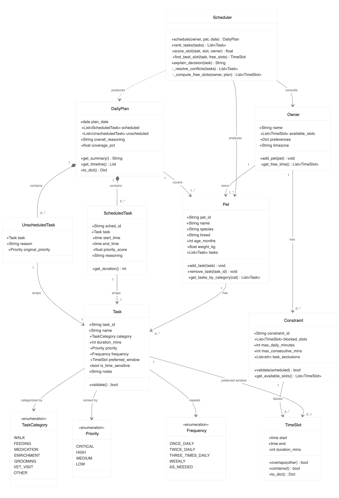

# PawPal+ Project Reflection

## 1. System Design

**a. Initial design**

- Briefly describe your initial UML design.
    - The UML has three layers:
        - **Data entry** — Owner stores who's available and when. Pet groups all care tasks for a specific animal. Task is the central unit: it holds the task name, category (walk/feeding/medication/etc.), duration, priority level, repeat frequency, preferred time window, and a flag for time-sensitive tasks like medication.
        - **Constraints** — Constraint belongs to an Owner and captures blocked time windows, a daily minute cap, and which tasks to exclude. Its validate() method is what the scheduler calls to check a candidate plan.
        - **Scheduling output** — Scheduler is stateless; given an owner, pet, and date it produces a DailyPlan. The plan splits results into scheduled and unscheduled tasks, stores an overall rationale string, and tracks coverage percentage. Each slot in the plan is a ScheduledTask — a wrapper around the original Task that adds a concrete start/end time, a numeric score, and a reasoning string explaining why that slot was chosen.
    - The key separation is that Scheduler produces DailyPlan (dashed arrow) rather than owning it — plans are standalone outputs the UI can render independently.

- What classes did you include, and what responsibilities did you assign to each?
    - **Owner** — represents the human side of the system. Responsible for storing the owner's name, available time slots, and preferences, and for grouping the pets they own. It also holds any constraints that reflect the owner's real-world limits.
    - **Pet** — represents the animal. Responsible for storing identity info (name, species, breed, age) and acting as the container for all tasks associated with that pet. It owns the add/remove/query methods for its task list.
    - **Task** — the central unit of work. Responsible for describing a single care activity in full: what it is, how it's categorized, how long it takes, how important it is, how often it repeats, when it's preferred, and whether it's time-sensitive. All scheduling decisions trace back to data living here.
    - **Constraint** — belongs to an Owner and represents real-world limits. Responsible for defining blocked time windows, a daily minute cap, and task exclusions. Its validate() method gives the scheduler a single call to check whether a proposed plan respects all restrictions.
    - **Scheduler** — the scheduling engine. Responsible for taking an owner, a pet, and a target date and producing a DailyPlan. Internally it ranks tasks by priority, scores candidate time slots, resolves conflicts, and generates a plain-language explanation for each decision. It is intentionally stateless — it holds no data of its own.
    - **ScheduledTask** — a thin output wrapper. Responsible for pairing a Task with a concrete start and end time, a numeric priority score, and a reasoning string. This is what carries the "explain why" information through to the UI.
    - **DailyPlan** — the final output object. Responsible for holding the full result of one scheduling run: the list of successfully scheduled tasks, any tasks that couldn't be placed, an overall rationale summary, and a coverage percentage. It exposes a get_timeline() method the UI consumes directly.

**b. Design changes**

- Did your design change during implementation? If yes, describe at least one change and why you made it.
    - Added DailyPlan → Pet (covers) relationship and replaced the bare List<Task> unscheduled with a new UnscheduledTask wrapper class that carries a reason field, mirroring the ScheduledTask pattern.
---

## 2. Scheduling Logic and Tradeoffs

**a. Constraints and priorities**

- What constraints does your scheduler consider (for example: time, priority, preferences)?
    - Time (availability) — Owner.available_slots defines the window the owner can act. The scheduler only places tasks inside these slots, and each placed task shrinks the remaining free time via _subtract_booked.
    - Priority — Priority (CRITICAL → HIGH → MEDIUM → LOW) and is_time_sensitive are the primary sort keys in rank_tasks. Higher-priority tasks claim slots before lower-priority ones can.
    - Preferred window — Task.preferred_window is a soft preference. find_best_slot actively looks for a free slot that overlaps the window; it only falls back to any available slot if none overlap.
    - Minimum gap between occurrences — _MIN_GAP_MINS enforces spacing between recurrences of the same task (e.g. 4 hours between TWICE_DAILY feedings), trimming free slots with _trim_slots_before.
    - Duration fit — a slot is only considered a candidate if slot.duration_mins >= task.duration_mins.
- How did you decide which constraints mattered most?
    - Time availability is the hard constraint — without a free slot nothing can be placed at all, so it's checked first. Priority and is_time_sensitive are the deciding factors when multiple tasks compete for the same window; a missed CRITICAL task (medication, feeding) has real consequences for the pet, so it must win over a LOW task (grooming) every time. Preferred window is intentionally soft — pet care tasks have natural rhythms (morning walk, evening feeding) that the schedule should respect when possible, but an owner's limited availability matters more than perfect timing. Minimum gaps are a correctness constraint specific to multi-daily tasks and only apply to those frequencies.

**b. Tradeoffs**

- Describe one tradeoff your scheduler makes.
    - The scheduler uses a greedy, first-fit algorithm — it sorts tasks by priority once, then places each task into the earliest available slot that fits, never revisiting earlier decisions.
- Why is that tradeoff reasonable for this scenario?
    - Pet care scheduling has a small, bounded task list (typically under 20 tasks per day) with hard owner availability as the primary constraint. A greedy approach produces a correct, actionable schedule in linear time without the complexity of backtracking or exhaustive search. The cost of the tradeoff — a suboptimal arrangement where a high-priority task placed early blocks a slot that could have fit two lower-priority tasks — is low in practice, because rank_tasks already ensures the most critical tasks (CRITICAL priority, is_time_sensitive=True) claim their preferred windows first. For this domain, a "good enough in milliseconds" schedule is far more useful to an owner than a mathematically optimal one that takes seconds to compute.

---

## 3. AI Collaboration

**a. How you used AI**

- How did you use AI tools during this project (for example: design brainstorming, debugging, refactoring)?
- What kinds of prompts or questions were most helpful?

**b. Judgment and verification**

- Describe one moment where you did not accept an AI suggestion as-is.
- How did you evaluate or verify what the AI suggested?

---

## 4. Testing and Verification

**a. What you tested**

- What behaviors did you test?
- Why were these tests important?

**b. Confidence**

- How confident are you that your scheduler works correctly?
- What edge cases would you test next if you had more time?

---

## 5. Reflection

**a. What went well**

- What part of this project are you most satisfied with?

**b. What you would improve**

- If you had another iteration, what would you improve or redesign?

**c. Key takeaway**

- What is one important thing you learned about designing systems or working with AI on this project?
